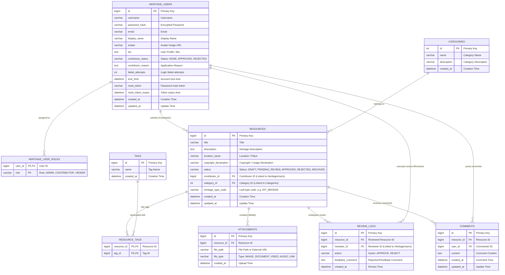

# Heritage Platform - Backend

## Entity-Relationship Diagram (ERD)



### Backend Setup

1. **Navigate to the backend directory:**
   ```bash
   cd platform
   ```

2. **Configure your local environment:**
   Copy the example configuration file to create your own local `application.properties`:
   ```bash
   cp src/main/resources/application.properties.example src/main/resources/application.properties
   ```
   *Note: Open `application.properties` and update `spring.datasource.password` if your local MySQL has a password.*

3. **Start the application:**
   ```bash
   ./mvnw spring-boot:run
   ```
