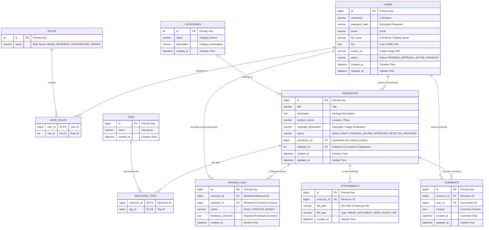

# Heritage Platform - Backend

## Entity-Relationship Diagram (ERD)

```mermaid
erDiagram
    %% 1. User & Permission Module
    USERS {
        bigint id PK "Primary Key"
        varchar username "Username"
        varchar password_hash "Encrypted Password"
        varchar email "Email"
        varchar full_name "Full Name / Display Name" 
        text bio "User Profile / Bio"
        varchar avatar_url "Avatar Image URL"
        varchar status "Status: PENDING_APPROVAL, ACTIVE, DISABLED"
        datetime created_at "Creation Time"
        datetime updated_at "Update Time"
    }
    
    ROLES {
        int id PK "Primary Key"
        varchar name "Role Name: ADMIN, REVIEWER, CONTRIBUTOR, VIEWER"
    }
    
    USER_ROLES {
        bigint user_id PK, FK "User ID"
        int role_id PK, FK "Role ID"
    }

    %% 2. Core Resource Module
    RESOURCES {
        bigint id PK "Primary Key"
        varchar title "Title"
        text description "Heritage Description"
        varchar location_name "Location / Place"
        varchar copyright_declaration "Copyright / Usage Declaration"
        varchar status "Status: DRAFT, PENDING_REVIEW, APPROVED, REJECTED, ARCHIVED"
        bigint contributor_id FK "Contributor ID (Linked to Users)"
        int category_id FK "Category ID (Linked to Categories)"
        datetime created_at "Creation Time"
        datetime updated_at "Update Time"
    }
    
    CATEGORIES {
        int id PK "Primary Key"
        varchar name "Category Name"
        varchar description "Category Description"
        datetime created_at "Creation Time"
    }
    
    TAGS {
        bigint id PK "Primary Key"
        varchar name "Tag Name"
        datetime created_at "Creation Time"
    }
    
    RESOURCE_TAGS {
        bigint resource_id PK, FK "Resource ID"
        bigint tag_id PK, FK "Tag ID"
    }
    
    ATTACHMENTS {
        bigint id PK "Primary Key"
        bigint resource_id FK "Resource ID"
        varchar file_path "File Path or External URL"
        varchar file_type "Type: IMAGE, DOCUMENT, VIDEO, AUDIO, LINK"
        datetime created_at "Upload Time"
    }

    %% 3. Review & Interaction Module
    REVIEW_LOGS {
        bigint id PK "Primary Key"
        bigint resource_id FK "Reviewed Resource ID"
        bigint reviewer_id FK "Reviewer ID (Linked to Users)"
        varchar action "Action: APPROVE, REJECT"
        text feedback_comment "Rejection/Feedback Comment"
        datetime created_at "Review Time"
    }
    
    COMMENTS {
        bigint id PK "Primary Key"
        bigint resource_id FK "Resource ID"
        bigint user_id FK "Commenter ID"
        text content "Comment Content"
        datetime created_at "Comment Time"
        datetime updated_at "Update Time"
    }

    %% Relationships
    USERS ||--o{ USER_ROLES : "assigned to"
    ROLES ||--o{ USER_ROLES : "contains"
    USERS ||--o{ RESOURCES : "submits (Contributor)"
    CATEGORIES ||--o{ RESOURCES : "belongs to"
    RESOURCES ||--o{ RESOURCE_TAGS : "has tags"
    TAGS ||--o{ RESOURCE_TAGS : "associated with"
    RESOURCES ||--o{ ATTACHMENTS : "contains (Media)"
    RESOURCES ||--o{ REVIEW_LOGS : "undergoes review"
    USERS ||--o{ REVIEW_LOGS : "executes review (Reviewer)"
    RESOURCES ||--o{ COMMENTS : "receives comments"
    USERS ||--o{ COMMENTS : "posts comments"
```
